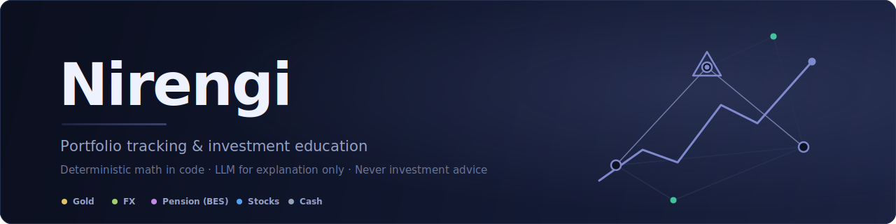
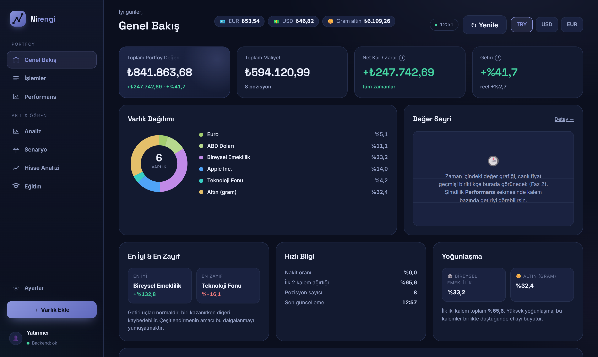
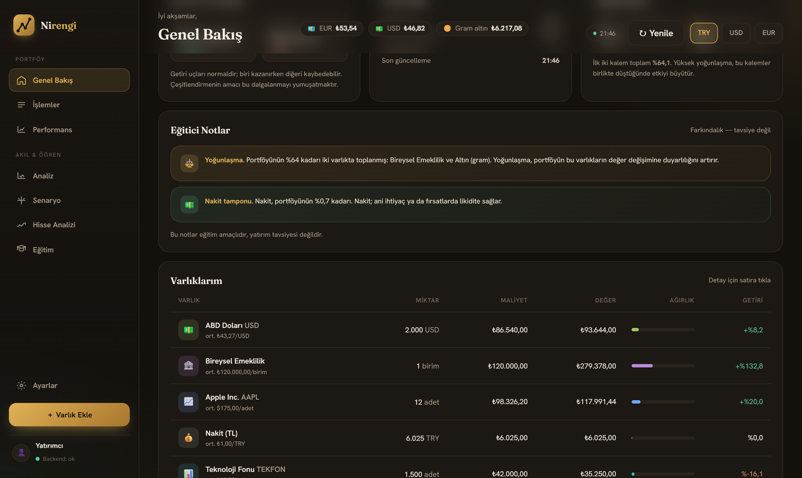
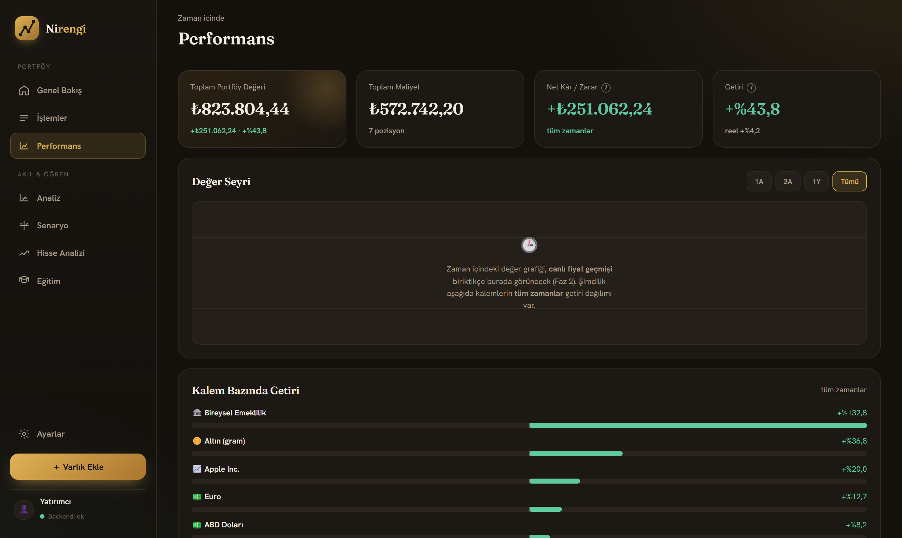
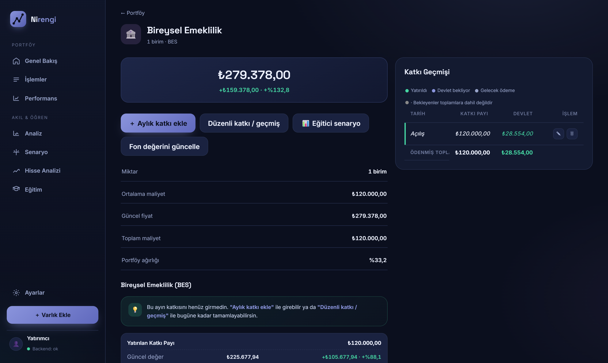
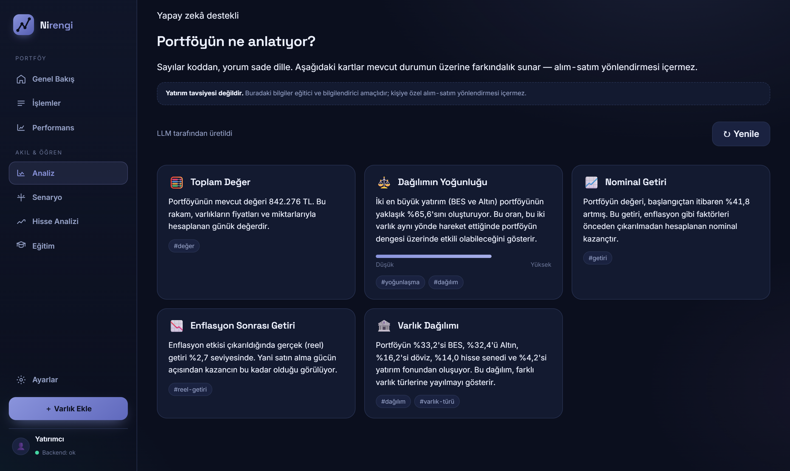
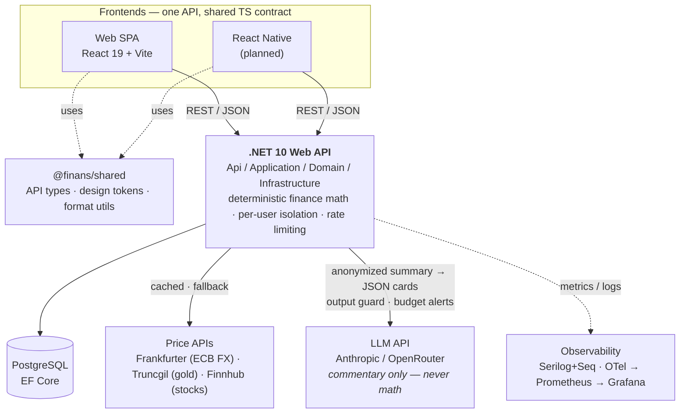

<div align="center">



[](backend)
[](web)
[](packages/shared)
[](backend)
[](#-testing)
[](LICENSE)

**Nirengi** (Turkish for *triangulation point*) is a portfolio tracking and investment
**education** app for beginner investors — built for markets like Turkey, where a typical
household portfolio mixes gram gold, foreign currency, private pension (BES) and stocks,
and no approachable tool explains what any of it means.

*You track what you own. The app computes what it's worth — and teaches you what that means.*

</div>

> [!IMPORTANT]
> **Not investment advice — by architecture, not by footnote.** Nirengi never says *buy*,
> *sell* or *this will go up*. Every number is computed deterministically in tested backend
> code; the LLM layer only **explains** finished results in plain language, behind an output
> guard that blocks directive/predictive phrasing. Every commentary surface carries a
> permanent disclaimer.

---

## ✨ A look around

**Overview** — total value, net P/L, real (inflation-adjusted) return, allocation donut and
live gold/FX price chips, all converted into your chosen base currency (₺ / $ / €):



**Contextual educational notes** — rule-triggered awareness cards (concentration, cash
buffer…) above the holdings table. Educational, explicitly *not* advice:



<table>
  <tr>
    <td width="50%">
      <strong>Performance</strong> — per-asset return distribution over time windows,
      nominal and real.
      
    </td>
    <td width="50%">
      <strong>BES (Turkish private pension)</strong> — own vs. state-matched contributions
      tracked separately, vesting, contribution history, annual state-cap rules and an
      educational projection tool.
      
    </td>
  </tr>
</table>

**AI commentary** — "What is your portfolio telling you?" The LLM receives the
*already-computed* numbers and turns them into 3–5 educational cards (concentration
meter, nominal vs. real return, allocation) — behind an output guard, with the
disclaimer always visible:



There's more behind the menu: an asset-add flow with transaction history, and
scenario / stock-analysis / lessons modules arriving in the current phase.

## 🧭 Why this exists

Most portfolio apps assume you already know what a P/E ratio or concentration risk is.
Beginner investors in Turkey typically hold gram gold, USD/EUR, BES and a few stocks —
spread across apps that don't talk to each other and explain nothing. Nirengi fills that
gap with four principles:

1. **Numbers from code, words from the LLM.** All financial math — cost basis, returns,
   real returns, allocation weights, currency conversion — runs as deterministic,
   unit-tested `decimal` code in .NET. The LLM receives *finished* results and produces
   structured JSON commentary. No number is ever generated by a model.
2. **No advice, by construction.** Turkey regulates investment advice (SPK licensing).
   Beyond prompt design, `CommentaryOutputGuard` scans every LLM response for
   directive/predictive patterns and blocks them before they reach the user.
3. **Security & isolation from day one.** Per-user data scoping on every query (foreign
   records → 404), secrets only via env/user-secrets, structured logging with PII
   redaction, IDOR scenarios in the integration suite.
4. **Resilience over features.** Every external dependency (price APIs, LLM) has a cache,
   a fallback and metrics. LLM down → last successful commentary. Price API down → last
   cached price, flagged as approximate. The app never breaks because a third party did.

## 📦 Features

| Area | Status | Notes |
|------|:------:|-------|
| Manual asset entry & transactions | ✅ | Gold, FX, cash, BES, stocks; weighted average cost derived from transactions |
| Portfolio dashboard | ✅ | Total value, net P/L, per-asset returns, allocation donut, best/worst cards |
| Multi-currency | ✅ | Per-asset currency + TRY/USD/EUR base-currency switch |
| Real (inflation-adjusted) returns | ✅ | `(1 + nominal) / (1 + inflation) − 1` |
| BES private pension | ✅ | State contribution as a separate line, vesting tiers, annual caps, educational projection |
| Live prices | ✅ | FX via [Frankfurter](https://frankfurter.dev) (ECB), gram gold via Truncgil — both keyless; 10-min cache + stale fallback |
| Contextual educational notes | ✅ | Rule-triggered (concentration, cash buffer, single-asset weight) |
| LLM portfolio commentary | ✅ | Anthropic or OpenRouter behind one `ILlmClient`; JSON-schema-enforced output, safety guard, cache + last-successful fallback, cost metrics & Prometheus budget alerts |
| Stock fundamentals (US, Finnhub) | 🚧 | P/E, P/B, dividend yield, EPS growth + LLM *explanation* — never prediction |
| Scenario simulator & lessons | 🔜 | Backtest-style "what if" education + bite-size lessons tied to your own portfolio |
| BIST (Istanbul exchange) data | 🔜 | Deferred — reliable BIST sources are mostly paid |
| React Native mobile app | 🔜 | Same API + `@finans/shared`; web ships first |
| Authentication (JWT) & multi-user | 🔜 | Data model ready (users, roles, refresh tokens, audit log) |

## 🏗 Architecture



**Monorepo layout** (pnpm workspaces):

```
finans/
├── backend/            .NET 10 Web API — src/ (Api, Application, Domain, Infrastructure) + tests/
├── web/                React 19 + TypeScript + Vite SPA (primary frontend)
├── packages/shared/    @finans/shared — API types, design tokens, format utilities
├── compose/            Prometheus / Grafana / Caddy configs
└── docker-compose.yml  Full stack: API + PostgreSQL + Redis + Seq + Prometheus + Grafana
```

## 🚀 Getting started

**Prerequisites: Git + Docker Desktop.** Nothing else — the API and the web UI
are compiled inside Docker.

```bash
git clone https://github.com/fsalihabiter/finans.git
cd finans
cp .env.example .env          # optional: set LLM_API_KEY for AI commentary
docker compose up -d --build  # web + API + PostgreSQL + observability stack
```

Then open **https://localhost** (accept the local-certificate warning once).

No LLM API key? The app still runs — a no-op client serves fallback text, so commentary
degrades gracefully instead of crashing.

> 📘 Step-by-step guide (install commands, everyday operations, troubleshooting): [SETUP.md](SETUP.md)
> · Contributor/hot-reload workflow: [`.claude/docs/06-DEV-PLAYBOOK.md`](.claude/docs/06-DEV-PLAYBOOK.md)

## 🧪 Testing

Financial math is only accepted with green unit tests — a wrong number is the
highest-severity bug in a finance app.

```bash
cd backend && dotnet test    # 156 unit (Application) + 90 integration tests
pnpm test                    # web + shared package tests
```

The integration suite covers per-user isolation (IDOR), external-API failure/fallback
paths, rate limiting and LLM guard behaviour.

## 📚 Documentation

Engineering docs live in [`.claude/docs/`](.claude/docs/README.md) — architecture, data
model, API contract, LLM integration & guardrails, security threat model, observability,
testing strategy. They are currently written in Turkish (the project's first audience);
an English migration is planned as the project opens up.

## 🗺 Roadmap

Phases 0–3 are complete (skeleton → portfolio MVP → live prices → LLM commentary layer).
Phase 4 (stock fundamentals) is in progress. Full plan: [ROADMAP.md](ROADMAP.md).

## 📄 License

[MIT](LICENSE) © 2026 Fatıma Saliha Biter

---

<div align="center">
<sub>Nirengi is an educational tool. Nothing it produces is investment advice, a
recommendation, or a prediction. Always consult a licensed advisor for personal
financial decisions.</sub>
</div>
